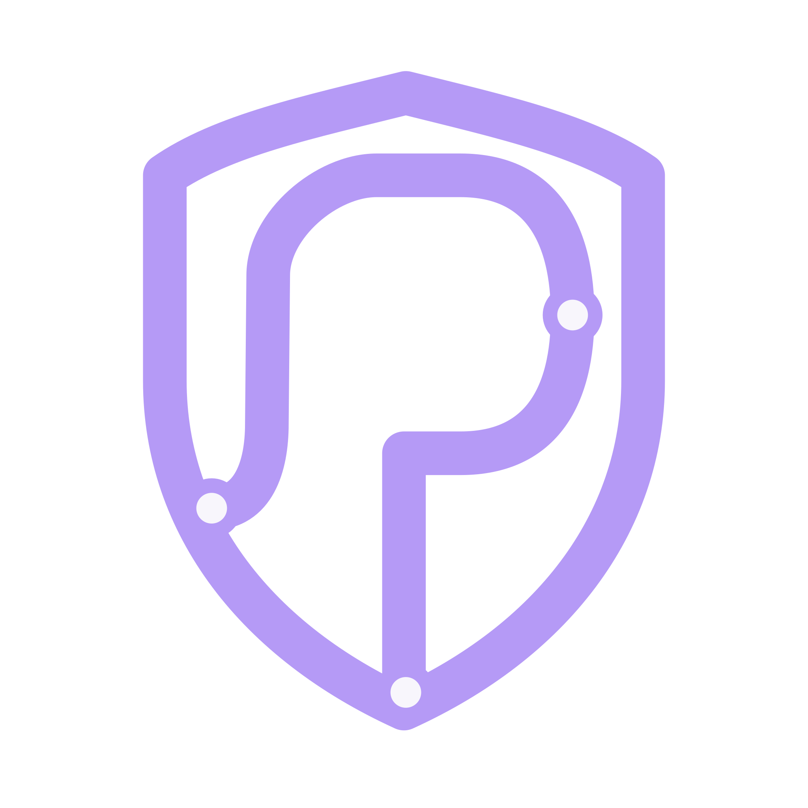

# Proofline Website

<p align="center">
  
</p>

<h2 align="center">Record the truth. Keep the keys.</h2>

<p align="center">
  <a href="https://github.com/open-proofline/website/actions/workflows/ci.yml"></a>
  <a href="LICENSE"></a>
  <a href="#current-status"></a>
  <a href="SECURITY.md"></a>
  <a href="https://proofline.live/support/"></a>
</p>

<p align="center">
  Static public website for experimental, AGPL-licensed, public-interest
  privacy and evidence infrastructure built to stay in public hands.
</p>

Proofline is experimental. It is not an emergency service, emergency dispatch
system, emergency-services integration, staffed response center, or guaranteed
real-time response workflow.

This repository publishes [proofline.live](https://proofline.live). It is also
the canonical source for Proofline's public governance posture, political
alignment, public-good framing, and baseline README style. The website should
sound like public-interest infrastructure with a spine, not a SaaS pitch deck
with better lighting.

## What This Repository Is

`open-proofline/website` is:

- the Astro static public website for Proofline
- the public framing and source-link surface for the project
- the home for website-specific documentation and contributor guidance
- the canonical source for Proofline's public governance posture and political
  alignment
- the reusable README baseline and public-voice reference for future Proofline
  repositories
- a validation-only CI target that builds static assets and uploads a build
  artifact

## What This Repository Is Not

This repository is not:

- the Go backend
- the React web-client or account portal
- a mobile app
- a protocol implementation
- an admin/operator tool
- an emergency system
- production deployment approval for any Proofline component
- a place to publish secrets, private deployment details, exploit payloads,
  incident data, request bodies, uploaded bytes, plaintext, raw keys,
  wrapped-key ciphertext, object-store details, or user safety data

Do not add backend, auth/session, recording/capture, notification, hosted-account
billing, payment-gated access, decryption, export, protocol, admin/operator, or
mobile-client behavior here.

## Current Status

Proofline is experimental, maintainer-led, and not production-ready emergency
infrastructure.

Current website status:

- Astro static site
- TypeScript
- Tailwind CSS through the Vite Tailwind plugin
- site-local components under `src/components/`
- routes under `src/pages/`
- static assets under `public/`
- central site metadata in `site.config.mjs`
- Cloudflare Workers static-assets deployment config in `wrangler.jsonc`
- CI validation on pull requests and `main`
- no CI deployment automation

The public website may summarize current project state, but backend and
web-client implementation facts still belong to their own repositories. Claims
should stay source-backed. Prototype optimism is not a safety feature.

## Governance And Public-Good Posture

Proofline is intended to grow as public-good open-source infrastructure. The
planned long-term direction is a non-distributing cooperative or similar
mission-locked public-good structure aligned with cooperative and libertarian
socialist principles.

The core posture:

- public-good infrastructure
- workplace democracy and shared accountability
- transparent worker compensation
- pay for labour, not ownership extraction
- surplus reinvestment into Proofline and aligned public-good work
- self-hosting and open source as anti-capture design constraints
- resistance to vendor lock-in, investor capture, and trust-branded SaaS
  mutation

Proofline does not currently claim to be an incorporated cooperative, registered
charity, registered nonprofit, foundation, company, or staffed governance body.
If the project reaches that stage, governance should make project capture
harder, not merely better branded.

Read the canonical source:
[`docs/governance-and-political-alignment.md`](docs/governance-and-political-alignment.md).

Use the reusable README baseline:
[`docs/repository-readme-baseline.md`](docs/repository-readme-baseline.md).

## Project Map

| Repository                                                                  | Status                | Role                                                                                                                                                                                                 |
| --------------------------------------------------------------------------- | --------------------- | ---------------------------------------------------------------------------------------------------------------------------------------------------------------------------------------------------- |
| [`open-proofline/website`](https://github.com/open-proofline/website)       | Current, experimental | Static public website, public framing, governance posture, README baseline, Codex workflow prompts                                                                                                   |
| [`open-proofline/server`](https://github.com/open-proofline/server)         | Current, experimental | Go backend, authenticated `/v1` API, private admin surfaces, encrypted chunk ingest, metadata, storage, viewer, deployment and security docs                                                         |
| [`open-proofline/web-client`](https://github.com/open-proofline/web-client) | Current, experimental | React account portal and incident-review prototype for account flows, conservative browser session handling, and metadata views. Not a recorder, emergency workflow, or production decryption client |
| `open-proofline/ios-client`                                                 | Planned               | Future native iOS capture, encrypted local staging, upload, account flows, and platform-specific recording behavior                                                                                  |
| `open-proofline/android-client`                                             | Planned               | Future native Android capture, encrypted local staging, upload, account flows, and platform-specific recording behavior                                                                              |
| `open-proofline/protocol`                                                   | Planned               | Future shared API specs, encryption envelope specs, bundle manifests, compatibility matrix, and conformance tests                                                                                    |

Planned repositories should not be described as implemented until they exist and
their scope is documented.

## Source-Of-Truth Map

Use the right source for the claim:

| Topic                                                 | Read                                                                                       |
| ----------------------------------------------------- | ------------------------------------------------------------------------------------------ |
| Website repo scope, validation, deployment boundary   | [`README.md`](README.md), [`AGENTS.md`](AGENTS.md), [`CONTRIBUTING.md`](CONTRIBUTING.md)   |
| Website security reporting                            | [`SECURITY.md`](SECURITY.md)                                                               |
| Governance and political posture                      | [`docs/governance-and-political-alignment.md`](docs/governance-and-political-alignment.md) |
| Reusable README structure and public voice            | [`docs/repository-readme-baseline.md`](docs/repository-readme-baseline.md)                 |
| Public website content                                | [`src/pages/`](src/pages/), [`src/components/`](src/components/)                           |
| Site metadata and repository URLs                     | [`site.config.mjs`](site.config.mjs)                                                       |
| Codex workflows                                       | [`codex/README.md`](codex/README.md), [`codex/prompts/`](codex/prompts/)                   |
| Organization-level framing                            | [`open-proofline/.github`](https://github.com/open-proofline/.github)                      |
| Backend behavior, deployment, API, and security facts | [`open-proofline/server`](https://github.com/open-proofline/server)                        |
| Web-client behavior and prototype limits              | [`open-proofline/web-client`](https://github.com/open-proofline/web-client)                |

Keep repository-specific facts in the repository that owns them. Keep
project-wide governance posture here.

## Public Claim Boundaries

The website must not imply that Proofline currently provides:

- production readiness
- emergency dispatch or emergency-services integration
- guaranteed emergency response
- a staffed response center
- production mobile recording clients
- production GPS/location capture
- trusted-contact SMS, email, push, or Messenger notifications
- production live context sharing
- hosted-account billing, subscriptions, payment-gated access, or active paid
  account creation
- backend, browser, or trusted-contact decryption
- key escrow or raw server-held media keys
- playable media export
- public admin/operator tooling

Future concepts must stay future-tense unless the source repositories document
them as implemented.

## Public Voice

Proofline's public voice should be:

- serious about safety, privacy, and public trust
- clear and humane
- principled without becoming foggy
- dryly witty where the humour clarifies values
- openly anti-SaaS and anti-capture when discussing governance, vendors,
  funding, and community services

Keep safety, security, implementation status, metadata, navigation, encryption,
decryption, key-custody, vulnerability-reporting, and cryptocurrency transaction
warnings plain. One sharp line per section is usually enough.

## Local Development

Requirements:

- Node.js 22, matching [`.nvmrc`](.nvmrc)
- npm

Install dependencies:

```bash
npm ci
```

Run the development server:

```bash
npm run dev
```

Build the static site:

```bash
npm run build
```

Preview a production build locally:

```bash
npm run preview
```

## Validation

Run these checks before opening, merging, or pushing changes:

```bash
npm run format:check
npm run check
npm run lint
npm run build
npm audit --audit-level=moderate --omit=dev
git diff --check
```

CI runs formatting, Astro/TypeScript checks, linting, dependency audit, build,
and a tracked-file whitespace scan. It uploads the built `dist/` artifact. CI
does not deploy this site.

There is no separate unit or end-to-end test runner configured yet. Do not add a
placeholder test script that passes without testing.

## Cloudflare Static Deployment Boundary

This site is configured for Cloudflare Workers static assets. Astro builds to
`dist/`, and Wrangler reads [`wrangler.jsonc`](wrangler.jsonc) for static asset
serving.

Useful commands:

```bash
npm run build
npm run cf:preview
npm run deploy
```

Deployment is a maintainer action from an authenticated environment. No
Cloudflare API tokens, account IDs, project IDs, or deployment credentials
belong in this repository.

CI must not require deployment secrets unless that policy is explicitly changed
later. Temporary preview URLs are not canonical production URLs.

## Codex Workflows

Reusable Codex prompts live under [`codex/prompts/`](codex/prompts/).

To use one:

1. Read [`AGENTS.md`](AGENTS.md).
2. Read [`codex/README.md`](codex/README.md).
3. Choose the prompt that matches the task.
4. Inspect the source-of-truth docs named by the prompt.
5. Inspect the current files involved in the task. Current files override stale
   prompt assumptions.
6. Keep edits under `website/` unless the maintainer explicitly scopes
   cross-repository work.

Codex output is maintainer-reviewed work. It is not an audit, certification,
security review, or endorsement by OpenAI.

Backlog prompts create local draft Markdown files first. They do not create
public GitHub issues unless the maintainer explicitly asks for that follow-up.

## Contributing

See [`CONTRIBUTING.md`](CONTRIBUTING.md).

Before changing public content, inspect the relevant source documents and keep
current, experimental/partial, planned/future, and not-implemented behavior
separate.

Do not include secrets, tokens, private deployment details, exploit details,
request bodies, uploaded bytes, plaintext, raw keys, wrapped-key ciphertext,
object-store details, or user safety data in public docs, issues, tests,
screenshots, logs, or Codex artifacts.

## License

Proofline Website is licensed under the GNU Affero General Public License v3.0
only (`AGPL-3.0-only`). See [`LICENSE`](LICENSE).
